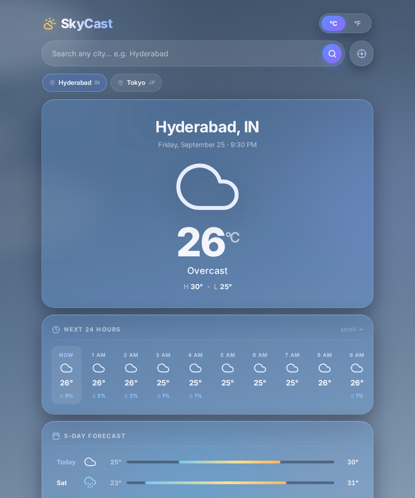
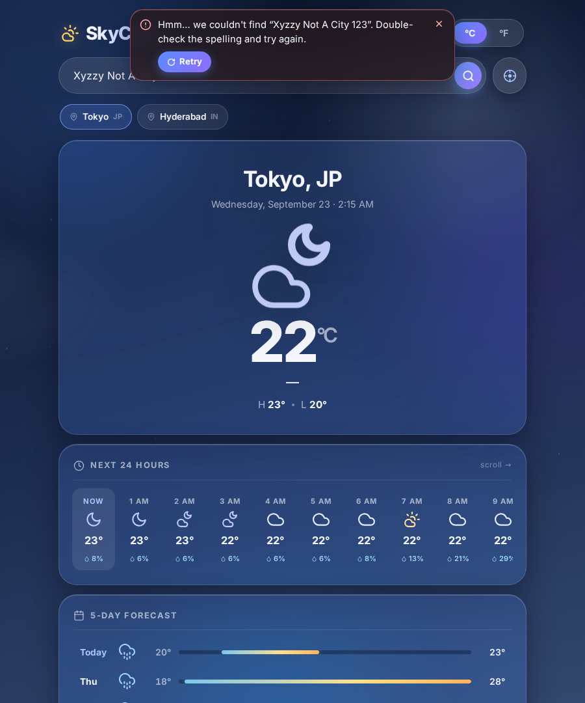
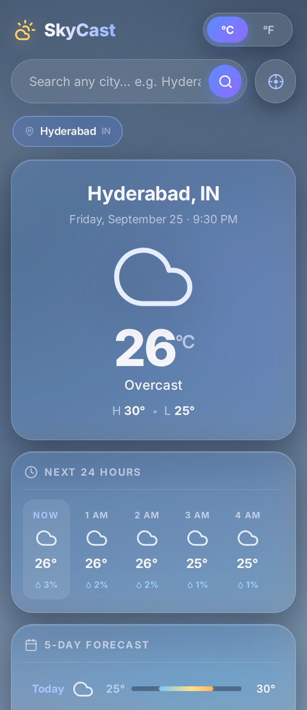

# 🌤️ SkyCast — Production-Grade Weather Dashboard

> **Status:** ✅ Phase 0–4 complete · ✅ **Phase 5: E2E integration suite** — 8 Playwright specs drive the real stack in CI (user journeys, cache HITs, GPS, toast-retry, and a CSP proof that the browser cannot reach weather providers). Next: **Phase 6 · deploy**. See [ARCHITECTURE.md](ARCHITECTURE.md).

A modern, responsive weather dashboard built with **vanilla HTML, CSS, and JavaScript** — no frameworks, no build step, no dependencies. Live data from the OpenWeatherMap API, wrapped in an atmospheric UI with dynamic weather-reactive skies, glassmorphism panels, and fluid micro-interactions.



## ✨ Features

### Dynamic atmospheric backgrounds
- 🌌 Sky theme **adapts to the weather condition + day/night cycle** — deep starry nights, bright sunny skies, moody overcast, stormy purple, snowy pastels
- 🌧️ Ambient FX layer: soft **rain streaks, drifting snowflakes, glowing sun/moon radial, drifting light clouds, fog banks, twinkling stars + shooting stars, and lightning flashes** during storms
- Smooth 1.4 s cross-fade between skies when you switch cities

### Fluid micro-interactions
- 🫧 **Skeleton shimmer loading** (mirrors the dashboard layout — zero layout shift)
- 🎞️ Staggered entrance animations, hover elevations, and press states on every card, chip, and button
- 🔄 City switches dim-and-refresh existing content instead of flashing a spinner

### Rich dashboard
- 🕐 **24-hour forecast slider** — horizontal scroll (drag on desktop, native swipe on touch) with per-hour icon, temperature, and precipitation-probability
- 📅 **5-day forecast** with min/max temps and gradient **temperature range bars**
- 📊 **8 metric tiles**: Humidity · Wind · Feels Like · **UV Index** · **Visibility** · **Atmospheric Pressure** · **Sunrise** · **Sunset**

### Frictionless search & location
- 📍 **"Use my location"** GPS button (reverse-geocoded to a city name)
- 🗂️ **Recent-search chips** (saved in `localStorage`) — one tap to switch cities
- 🛑 Contextual **error toasts with an inline Retry button** — plus a "Continue in demo mode" escape hatch if your API key is rejected
- ⌨️ Enter-to-search, drag-scrollable strips, keyboard focus states throughout

### Unit toggle
- 🔁 Segmented **°C ⇄ °F switch** — converts every value **instantly from cached data, with zero extra API calls** (preference persisted)

## 🚀 Getting Started

```bash
cd backend
cp .env.example .env        # then paste your OpenWeatherMap key into OPENWEATHER_API_KEY
npm install
npm start                   # → http://localhost:3000  (serves the app AND the API)
```

> No OpenWeatherMap key yet? Grab a free one at [openweathermap.org](https://home.openweathermap.org/api_keys) (new keys take ~10 min to activate). **The key lives only in `backend/.env`** — until it's set, the key-less Open-Meteo provider serves data automatically. The browser bundle contains no keys and cannot call weather providers (CSP-enforced).

The backend serves `frontend/` at the root (single origin — no CORS) and exposes:

| Endpoint | Status |
|---|---|
| `GET /api/v1/health` | ✅ live — provider chain + cache statistics |
| `GET /api/v1/weather?city=…\|lat,lon` | ✅ live — cached (10 min), stale-on-error, rate-limited |
| `GET /api/v1/geocode?q=…` · `/reverse` | ✅ live — cached (24 h) |

Run backend tests: `npm test` (inside `backend/`) — 49 contract/integration tests.

Run the E2E suite (boots the backend automatically, drives a real browser):

```bash
cd e2e && npm install && npx playwright install chromium
npx playwright test        # 8 specs: journeys, caching, GPS, toasts, CSP proof
```

## 📁 Project Structure

The repo is split into **absolute frontend / backend separation** — the browser bundle never talks to weather providers directly; everything routes through our backend (see [ARCHITECTURE.md](ARCHITECTURE.md) for the full contract, cache policy, and phase plan).

```
skycast-weather-app/
├── frontend/                  # browser territory — no secrets cross this line
│   ├── index.html
│   ├── styles/style.css       # sky themes, FX, glassmorphism, responsive grid
│   └── js/
│       ├── main.js            # entrypoint: wires stores, components, API
│       ├── api/client.js      # ★ the ONLY module that talks to the server (/api/v1)
│       ├── store/             # units · recents · volatile state
│       ├── components/        # hero · hourly · daily · tiles · chips · toasts · skeleton · search
│       ├── fx/                # sky/particle engine
│       └── utils/             # format (°C⇄°F, clocks) · icons · errors
├── backend/                   # server territory — all secrets live here
│   └── .env.example           # key NAMES only; real .env is git-ignored
├── docs/                      # screenshots
└── .github/workflows/ci.yml   # syntax checks + "no providers in frontend" guard
```

> **Status:** Phase 0 (restructure) complete. The backend API arrives in Phases 1–3;
> until then `frontend/js/app.js` runs in standalone demo mode exactly as before.

## 🖼️ Screenshots

| Desktop | Error toast | Mobile |
| --- | --- | --- |
|  |  |  |

## 🧠 Implementation Notes

- **One normalised data shape** — whether data comes from OpenWeatherMap or Open-Meteo, the render layer receives the same object, so both sources feed the identical UI
- **UV in OWM mode** — OpenWeatherMap's free plan has no UV endpoint, so SkyCast quietly borrows the current-hour UV from Open-Meteo (key-less); it degrades gracefully to "—"
- **Metric internally** — all temperatures are stored in °C and converted only at render time, which is what makes the unit toggle instant
- **Timeouts & friendly errors** — every fetch uses `AbortController` timeouts, and HTTP statuses map to human messages (404 → "couldn't find that city", 401 → key help, 429 → rate limit…)
- **Accessible** — ARIA roles/labels, `aria-live` toasts, visible focus rings, and full `prefers-reduced-motion` support (all particles freeze)
- **Performant FX** — every particle animates with `transform`/`opacity` only, and counts scale with condition intensity

## 🛠️ Built With

- **HTML5** — semantic, accessible markup
- **CSS3** — custom properties, `backdrop-filter` glass (with solid fallback), fluid `clamp()` type, keyframe particle system
- **Vanilla JavaScript (ES2020+)** — `async/await`, `AbortController`, `localStorage`, inline SVG icons, zero dependencies

## 🙌 Credits

Weather data: [OpenWeatherMap](https://openweathermap.org/api) · Demo & UV fallback: [Open-Meteo](https://open-meteo.com) · Reverse geocoding: [BigDataCloud](https://www.bigdatacloud.com)
